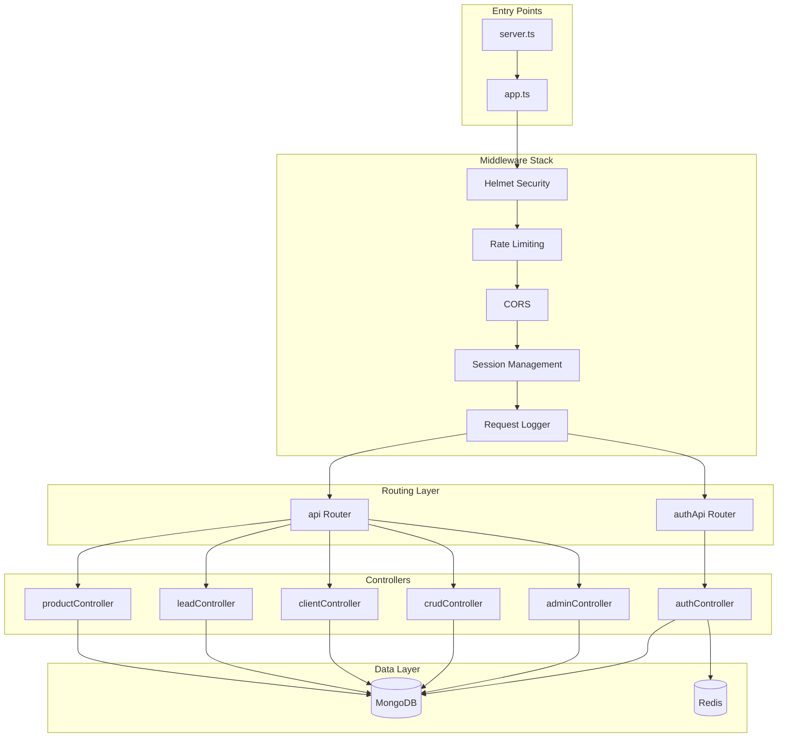
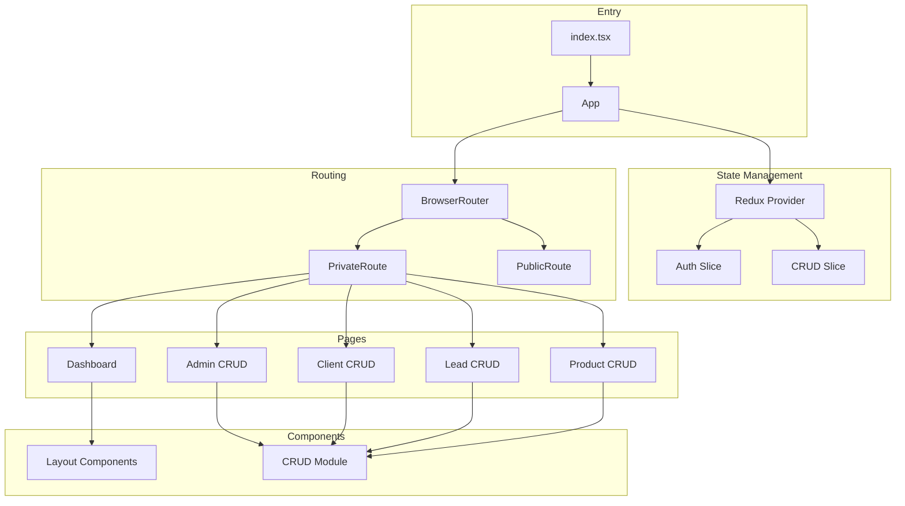
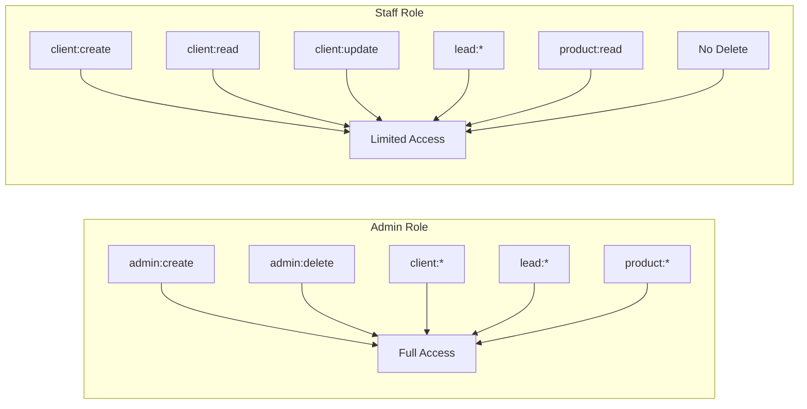
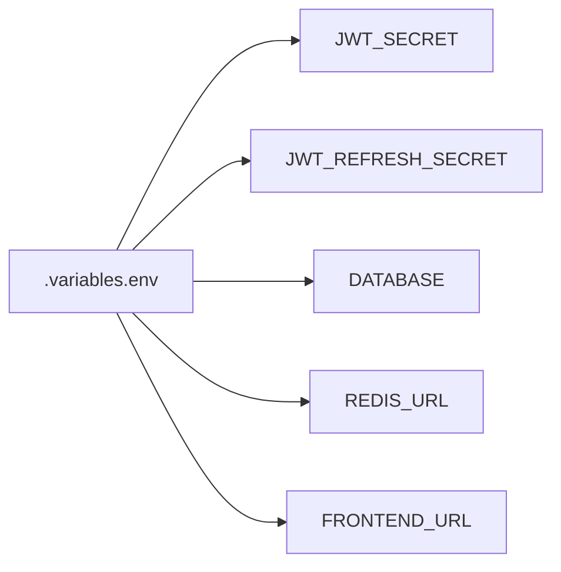

# Easy-Dashboard Pro - Expert Application Evaluation

## Executive Summary

**Application Type:** Full-stack MERN CRM Dashboard Application  
**Version:** 2.0.0  
**Evaluation Date:** February 2026  
**Overall Rating:** ⭐⭐⭐⭐ (4/5)

Easy-Dashboard Pro is a well-architected, production-ready CRM starter kit with strong security foundations and modern technology choices. The codebase demonstrates professional development practices with TypeScript migration, comprehensive validation, and proper separation of concerns.

---

## 1. Architecture Assessment

### 1.1 Backend Architecture



**Strengths:**
- ✅ Clean layered architecture with clear separation of concerns
- ✅ Generic CRUD controller pattern reduces code duplication
- ✅ Middleware-based request processing pipeline
- ✅ Centralized error handling with development/production modes
- ✅ Health check endpoints for container orchestration

**Areas for Improvement:**
- ⚠️ No service layer between controllers and models - business logic is mixed with HTTP handling
- ⚠️ Controllers directly import models, creating tight coupling
- ⚠️ No repository pattern for data access abstraction

### 1.2 Frontend Architecture



**Strengths:**
- ✅ Modern React 18 with functional components and hooks
- ✅ Redux Toolkit for simplified state management
- ✅ Reusable CRUD module pattern
- ✅ Proper route protection with authentication guards

**Areas for Improvement:**
- ⚠️ Mixed JavaScript and TypeScript files in frontend
- ⚠️ Some components use `.jsx` while others use `.tsx`
- ⚠️ No React Query for server state management (using manual axios)

---

## 2. Security Evaluation

### 2.1 Authentication & Authorization

| Feature | Implementation | Rating |
|---------|---------------|--------|
| JWT Access Tokens | 15-minute expiry, signed with secret | ✅ Good |
| Refresh Tokens | 7-day expiry, stored in DB | ✅ Good |
| Token Blocklist | Redis with in-memory fallback | ✅ Excellent |
| RBAC | Permission matrix by role | ✅ Good |
| Rate Limiting | 5 auth attempts / 15 min | ✅ Good |
| Password Hashing | bcrypt with salt | ✅ Good |

**Security Highlights:**

1. **Token Management** ([`utils/tokenBlocklist.ts`](utils/tokenBlocklist.ts:1))
   - Proper token revocation on logout
   - SHA-256 hashing of tokens before storage
   - Automatic TTL-based cleanup
   - Redis fallback to in-memory storage

2. **Input Validation** ([`validations/`](validations/))
   - Comprehensive Zod schemas for all endpoints
   - Field whitelisting prevents mass assignment
   - Regex escaping prevents ReDoS attacks

3. **HTTP Security Headers** ([`app.ts`](app.ts:34))
   - Helmet middleware with CSP
   - HSTS enabled for production
   - Proper CORS configuration

### 2.2 Security Concerns

| Issue | Severity | Location | Recommendation |
|-------|----------|----------|----------------|
| Default refresh secret in dev | Medium | [`authController.ts:22`](controllers/authController.ts:22) | Remove default, fail fast |
| Password in response objects | Low | [`adminController.ts:98`](controllers/adminController.ts:98) | Already handled with `select(-password)` |
| No CSRF token | Low | API routes | Consider CSRF protection for cookie-based auth |
| Account lockout not implemented | Medium | [`authController.ts`](controllers/authController.ts) | Add failed login tracking |

### 2.3 RBAC Implementation



The RBAC system in [`middleware/rbac.ts`](middleware/rbac.ts:42) is well-designed with:
- Type-safe permission strings
- Permission matrix for easy auditing
- Both role-based and permission-based middleware

---

## 3. Code Quality Assessment

### 3.1 TypeScript Usage

**Backend:** Strong TypeScript adoption
- ✅ Proper interface definitions for models
- ✅ Type-safe middleware and controllers
- ✅ Zod integration for runtime validation

**Frontend:** Partial TypeScript migration
- ⚠️ Mix of `.js`, `.jsx`, `.ts`, `.tsx` files
- ⚠️ Some `any` types in Redux slices
- ⚠️ Incomplete type coverage

### 3.2 Code Patterns

**Good Patterns:**
```typescript
// Generic CRUD controller - excellent reusability
export const read = async <T extends Document>(
  Model: Model<T>, 
  req: Request, 
  res: Response
) => { ... }

// Schema field validation prevents injection
const validateFields = (Model: Model<any>, fields: string[]) => {
  const schemaPaths = Object.keys(Model.schema.paths);
  // ...
}
```

**Areas for Improvement:**
```typescript
// Error handling could be more specific
catch {
  return res.status(500).json({ 
    success: false, 
    message: "Oops there is an Error" 
  });
}

// Should log the actual error for debugging
```

### 3.3 Error Handling

| Aspect | Status | Notes |
|--------|--------|-------|
| Global error handler | ✅ | Development vs production modes |
| Async error catching | ✅ | `catchErrors` wrapper function |
| Validation errors | ✅ | Zod errors returned with details |
| Logging | ✅ | Structured JSON logging with redaction |
| Error messages | ⚠️ | Some generic messages hide details |

---

## 4. Performance Considerations

### 4.1 Database Operations

**Strengths:**
- ✅ Pagination implemented on all list endpoints
- ✅ Index-friendly queries with `removed: false` filter
- ✅ Parallel queries with `Promise.all()` for count + results

**Concerns:**
- ⚠️ No database indexes defined in schemas
- ⚠️ Search uses regex which won't use indexes efficiently
- ⚠️ No query result caching

### 4.2 Frontend Performance

**Strengths:**
- ✅ Vite for fast builds and HMR
- ✅ Code splitting potential with React.lazy
- ✅ Ant Design tree-shaking support

**Concerns:**
- ⚠️ No lazy loading implemented for routes
- ⚠️ Large bundle with full Ant Design import
- ⚠️ No service worker for offline support

---

## 5. Testing Coverage

| Type | Status | Notes |
|------|--------|-------|
| Unit Tests | ⚠️ | Jest configured, minimal tests |
| Integration Tests | ⚠️ | Supertest available, not implemented |
| E2E Tests | ❌ | Not configured |
| Frontend Tests | ⚠️ | Vitest configured, minimal tests |

**Recommendation:** Add comprehensive test suites for:
1. Authentication flow
2. CRUD operations
3. RBAC permission checks
4. Token blocklist functionality

---

## 6. DevOps & Deployment

### 6.1 Containerization

The project includes Docker support:
- ✅ [`Dockerfile`](Dockerfile) for backend
- ✅ [`docker-compose.yml`](docker-compose.yml) for full stack
- ✅ Health checks for orchestration
- ✅ Non-root user in container

### 6.2 Environment Configuration



**Strengths:**
- ✅ Required env vars validated on startup
- ✅ `.env.example` provided
- ✅ Secrets not committed to repository

**Concerns:**
- ⚠️ No environment-specific configuration files
- ⚠️ No secrets management integration

---

## 7. Documentation Quality

| Document | Quality | Notes |
|----------|---------|-------|
| README.md | ✅ Good | Installation, usage, features |
| API Docs | ✅ Good | OpenAPI/Swagger specification |
| ADRs | ✅ Excellent | Architecture decision records |
| Code Comments | ⚠️ Mixed | Some files well-documented, others minimal |

---

## 8. Recommendations Summary

### High Priority

1. **Complete TypeScript Migration** - Convert remaining `.js/.jsx` files to TypeScript
2. **Add Database Indexes** - Define indexes for frequently queried fields
3. **Implement Account Lockout** - Track failed login attempts and lock accounts
4. **Add Comprehensive Tests** - Unit and integration tests for critical paths

### Medium Priority

5. **Extract Service Layer** - Separate business logic from controllers
6. **Implement Query Caching** - Use Redis for frequently accessed data
7. **Add Request Validation Logging** - Log validation failures for security monitoring
8. **Implement Soft Delete Restoration** - Add endpoint to restore deleted items

### Low Priority

9. **Add API Versioning** - Prepare for future API changes
10. **Implement Audit Logging** - Track who changed what and when
11. **Add WebSocket Support** - Real-time updates for dashboard
12. **Implement Feature Flags** - Enable/disable features without deployment

---

## 9. Security Checklist

| Item | Status | Notes |
|------|--------|-------|
| SQL/NoSQL Injection Prevention | ✅ | Parameterized queries, field validation |
| XSS Prevention | ✅ | CSP headers, input sanitization |
| CSRF Protection | ⚠️ | Consider for cookie-based auth |
| Rate Limiting | ✅ | Implemented on auth and API routes |
| Secure Headers | ✅ | Helmet with comprehensive config |
| Input Validation | ✅ | Zod schemas on all endpoints |
| Output Encoding | ✅ | JSON responses, no HTML rendering |
| Authentication | ✅ | JWT with refresh tokens |
| Authorization | ✅ | RBAC with permission matrix |
| Secrets Management | ⚠️ | Environment variables, no vault |
| Logging & Monitoring | ✅ | Structured logging with redaction |
| Error Handling | ✅ | No stack traces in production |

---

## 10. Final Verdict

### Strengths
- **Modern Stack:** TypeScript, React 18, Redux Toolkit, Mongoose 8
- **Security-First:** JWT with refresh tokens, token blocklist, RBAC
- **Developer Experience:** Hot reload, Swagger docs, comprehensive validation
- **Production Ready:** Docker support, health checks, error handling

### Weaknesses
- **Test Coverage:** Minimal automated tests
- **TypeScript Consistency:** Mixed JS/TS in frontend
- **Service Layer:** Business logic in controllers
- **Performance:** Missing database indexes

### Overall Assessment

Easy-Dashboard Pro is a **well-crafted starter kit** suitable for production use with minor improvements. The architecture is solid, security is well-implemented, and the codebase follows modern best practices. The main areas requiring attention are test coverage and completing the TypeScript migration.

**Recommended for:** Teams looking for a secure, modern CRM foundation who can invest in adding tests and completing the TypeScript migration.

---

*Evaluation conducted by expert code review - February 2026*
