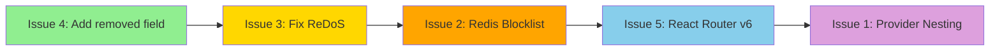

# Critical Issues Action Plan

This document provides a detailed, step-by-step action plan to address the critical issues identified in the application evaluation.

---

## Issue 1: Provider/Router Nesting Bug

### Problem
In [`frontend/src/app/index.jsx`](frontend/src/app/index.jsx:60-72), the Redux Provider is nested inside the Router, which can cause context issues and unexpected behavior.

**Current (Incorrect) Code:**
```jsx
<RouterHistory history={history}>
  <Provider store={store}>
    <ConfigProvider>
      <Router />
    </ConfigProvider>
  </Provider>
</RouterHistory>
```

### Solution

**Step 1:** Restructure the component hierarchy in [`frontend/src/app/index.jsx`](frontend/src/app/index.jsx)

**Correct Structure:**
```jsx
<Provider store={store}>
  <RouterHistory history={history}>
    <ConfigProvider theme={{ token: { colorPrimary: '#1DA57A' } }}>
      <Router />
    </ConfigProvider>
  </RouterHistory>
</Provider>
```

**Step 2:** Move the `useDispatch` and `useSelector` hooks inside a child component that is wrapped by the Provider.

**Files to Modify:**
- [`frontend/src/app/index.jsx`](frontend/src/app/index.jsx)

**Implementation Details:**
```jsx
// frontend/src/app/index.jsx
import React, { useEffect, useState, Suspense } from "react";
import { Router as RouterHistory } from "react-router-dom";
import { Provider, useDispatch, useSelector } from "react-redux";
import Router from "@/router";
import history from "@/utils/history";
import store from "@/redux/store";
import { Button, Result, ConfigProvider } from "antd";
import useNetwork from "@/hooks/useNetwork";
import { checkAuthStatus } from "@/redux/auth/actions";
import { selectAuth } from "@/redux/auth/selectors";

// Inner component that uses Redux hooks
function AppContent() {
  const { isOnline: isNetwork } = useNetwork();
  const dispatch = useDispatch();
  const { isAuthenticated, isLoading } = useSelector(selectAuth);
  const [initialized, setInitialized] = useState(false);

  useEffect(() => {
    const initAuth = async () => {
      await dispatch(checkAuthStatus());
      setInitialized(true);
    };
    initAuth();
  }, [dispatch]);

  if (!initialized || isLoading) {
    return (
      <div style={{ display: 'flex', justifyContent: 'center', alignItems: 'center', height: '100vh' }}>
        Loading...
      </div>
    );
  }

  if (!isNetwork) {
    return (
      <Result
        status="404"
        title="No Internet Connection"
        subTitle="Check your Internet Connection or your network."
        extra={<Button href="/" type="primary">Try Again</Button>}
      />
    );
  }

  return (
    <RouterHistory history={history}>
      <ConfigProvider theme={{ token: { colorPrimary: '#1DA57A' } }}>
        <Router />
      </ConfigProvider>
    </RouterHistory>
  );
}

// Root component with Provider at the top
function App() {
  return (
    <Provider store={store}>
      <AppContent />
    </Provider>
  );
}

export default App;
```

---

## Issue 2: In-Memory Token Blocklist

### Problem
The token blocklist is stored in memory, which:
- Does not scale across multiple server instances
- Loses all blocked tokens on server restart
- Creates security gaps in production

### Solution: Implement Redis-based Token Blocklist

**Step 1:** Install Redis dependencies

```bash
npm install redis @types/redis
```

**Step 2:** Create Redis configuration file

Create new file: `utils/redis.ts`

```typescript
// utils/redis.ts
import { createClient } from 'redis';
import dotenv from 'dotenv';

dotenv.config({ path: '.variables.env' });

const redisUrl = process.env.REDIS_URL || 'redis://localhost:6379';

const redisClient = createClient({
  url: redisUrl,
});

redisClient.on('error', (err) => console.error('Redis Client Error', err));

// Connect to Redis
let isConnected = false;

export const connectRedis = async () => {
  if (!isConnected) {
    await redisClient.connect();
    isConnected = true;
    console.log('Redis connected');
  }
};

export default redisClient;
```

**Step 3:** Update token blocklist implementation

Update file: `utils/tokenBlocklist.ts`

```typescript
// utils/tokenBlocklist.ts
import redisClient from './redis';

const TOKEN_PREFIX = 'blocked_token:';
const REFRESH_TOKEN_EXPIRY = 7 * 24 * 60 * 60; // 7 days in seconds

export const addToBlocklist = async (token: string, expiresInSeconds?: number) => {
  const key = `${TOKEN_PREFIX}${token}`;
  const expiry = expiresInSeconds || REFRESH_TOKEN_EXPIRY;
  await redisClient.setEx(key, expiry, '1');
};

export const isTokenBlocked = async (token: string): Promise<boolean> => {
  const key = `${TOKEN_PREFIX}${token}`;
  const result = await redisClient.get(key);
  return result !== null;
};

export const removeFromBlocklist = async (token: string) => {
  const key = `${TOKEN_PREFIX}${token}`;
  await redisClient.del(key);
};
```

**Step 4:** Update auth controller to use async blocklist

Update file: [`controllers/authController.ts`](controllers/authController.ts)

```typescript
// controllers/authController.ts (relevant changes)

import { addToBlocklist, isTokenBlocked } from '../utils/tokenBlocklist';

export const isValidToken = async (req: any, res: Response, next: NextFunction) => {
  // ... existing code ...
  
  if (await isTokenBlocked(token)) {
    return res.status(401).json({
      success: false,
      message: "Token has been revoked.",
      jwtExpired: true,
    });
  }
  
  // ... rest of the code ...
};

export const logout = async (req: any, res: Response) => {
  const token = req.header("x-auth-token");
  if (token) {
    // Calculate remaining token expiry for efficient Redis storage
    try {
      const decoded = jwt.decode(token) as { exp?: number };
      if (decoded?.exp) {
        const now = Math.floor(Date.now() / 1000);
        const remainingSeconds = decoded.exp - now;
        if (remainingSeconds > 0) {
          await addToBlocklist(token, remainingSeconds);
        }
      }
    } catch {
      await addToBlocklist(token);
    }
  }
  
  // ... rest of the code ...
};
```

**Step 5:** Initialize Redis connection on server startup

Update file: [`server.ts`](server.ts)

```typescript
// server.ts (add after mongoose connection)

import { connectRedis } from './utils/redis';

// ... existing mongoose connection code ...

// Connect to Redis
connectRedis().catch((err) => {
  console.error('Failed to connect to Redis:', err);
  // Continue without Redis in development
  if (process.env.NODE_ENV === 'production') {
    process.exit(1);
  }
});
```

**Step 6:** Add Redis URL to environment configuration

Update file: [`.variables.env.tmp`](.variables.env.tmp)

```env
# Add this line
REDIS_URL=redis://localhost:6379
```

---

## Issue 3: Regex DoS Vulnerability in Search

### Problem
In [`controllers/crudController/crudMethods.ts`](controllers/crudController/crudMethods.ts:181), user input is used directly in a RegExp without escaping special characters, allowing potential Denial of Service attacks.

**Current (Vulnerable) Code:**
```typescript
{ [field]: { $regex: new RegExp(q, "i") } }
```

### Solution

**Step 1:** Create a regex escape utility function

Create new file: `utils/regexEscape.ts`

```typescript
// utils/regexEscape.ts

/**
 * Escapes special regex characters in a string
 * Prevents Regex DoS attacks when using user input in RegExp
 */
export const escapeRegex = (str: string): string => {
  return str.replace(/[.*+?^${}()|[\]\\]/g, '\\$&');
};

/**
 * Creates a safe RegExp from user input
 * @param input - User input string
 * @param flags - RegExp flags (default: 'i' for case-insensitive)
 */
export const createSafeRegex = (input: string, flags: string = 'i'): RegExp => {
  return new RegExp(escapeRegex(input), flags);
};
```

**Step 2:** Update the search function in crudMethods

Update file: [`controllers/crudController/crudMethods.ts`](controllers/crudController/crudMethods.ts)

```typescript
// controllers/crudController/crudMethods.ts

import { escapeRegex } from '../../utils/regexEscape';

export const search = async <T extends Document>(Model: Model<T>, req: Request, res: Response) => {
  const q = req.query.q as string;
  if (!q || q.trim() === "") {
    return res.status(200).json({
      success: true,
      result: [],
      message: "Query is empty",
    });
  }

  // Escape special regex characters to prevent ReDoS
  const escapedQuery = escapeRegex(q.trim());
  const fieldsArray = (req.query.fields as string || "name").split(",");
  const searchFields: FilterQuery<T> = { $or: [] } as FilterQuery<T>;

  for (const field of fieldsArray) {
    (searchFields.$or as Array<Record<string, { $regex: RegExp }>>).push({ 
      [field]: { $regex: new RegExp(escapedQuery, "i") } 
    });
  }

  (searchFields as Record<string, unknown>).removed = false;

  // Add query length limit for additional protection
  if (escapedQuery.length > 100) {
    return res.status(400).json({
      success: false,
      result: null,
      message: "Search query too long",
    });
  }

  try {
    const results = await Model.find(searchFields).sort({ name: "asc" }).limit(10);

    return res.status(200).json({
      success: true,
      result: results,
      message: results.length > 0 ? "Documents found" : "No documents match search",
    });
  } catch {
    return res.status(500).json({
      success: false,
      result: null,
      message: "Error during search",
    });
  }
};
```

**Step 3:** Update adminController search function

Update file: [`controllers/adminController.ts`](controllers/adminController.ts:175-189)

```typescript
// controllers/adminController.ts

import { escapeRegex } from '../utils/regexEscape';

export const search = async (req: Request, res: Response) => {
  try {
    const query = req.query.q as string;
    if (!query || query.trim() === "") {
      return res.status(202).json({ success: false, result: [] });
    }

    // Escape special regex characters
    const escapedQuery = escapeRegex(query.trim());
    
    // Limit query length
    if (escapedQuery.length > 100) {
      return res.status(400).json({ 
        success: false, 
        result: [], 
        message: "Search query too long" 
      });
    }

    const fieldsArray = (req.query.fields as string || "name,surname,email").split(",");
    const fields = { 
      $or: fieldsArray.map(field => ({ 
        [field]: { $regex: new RegExp(escapedQuery, "i") } 
      })), 
      removed: false 
    };

    const result = await Admin.find(fields).select('-password').limit(10);
    return res.status(200).json({ success: true, result });
  } catch {
    return res.status(500).json({ success: false, result: [] });
  }
};
```

---

## Issue 4: Missing `removed` Field in Client Model

### Problem
The [`Client.ts`](models/Client.ts) model lacks the `removed` field used for soft delete, but the CRUD controller expects this field.

### Solution

**Step 1:** Update the Client model

Update file: [`models/Client.ts`](models/Client.ts)

```typescript
// models/Client.ts

export interface IClient extends Document {
  removed: boolean;  // Add this field
  enabled: boolean;
  company: string;
  // ... rest of the interface
}

const clientSchema = new Schema<IClient>({
  removed: {           // Add this field
    type: Boolean,
    default: false,
  },
  enabled: {
    type: Boolean,
    default: true,
  },
  // ... rest of the schema
});
```

**Step 2:** Similarly update Lead and Product models

Update file: [`models/Lead.ts`](models/Lead.ts)

```typescript
// Add to interface
removed: boolean;

// Add to schema
removed: {
  type: Boolean,
  default: false,
},
```

Update file: [`models/Product.ts`](models/Product.ts)

```typescript
// Add to interface
removed: boolean;

// Add to schema
removed: {
  type: Boolean,
  default: false,
},
```

**Step 3:** Create a migration script for existing data

Create new file: `scripts/addRemovedField.ts`

```typescript
// scripts/addRemovedField.ts
import mongoose from 'mongoose';
import dotenv from 'dotenv';

dotenv.config({ path: '.variables.env' });

const migrate = async () => {
  await mongoose.connect(process.env.DATABASE!);
  
  const collections = ['clients', 'leads', 'products'];
  
  for (const collection of collections) {
    try {
      await mongoose.connection.db.collection(collection).updateMany(
        { removed: { $exists: false } },
        { $set: { removed: false } }
      );
      console.log(`Migrated ${collection}`);
    } catch (err) {
      console.error(`Error migrating ${collection}:`, err);
    }
  }
  
  await mongoose.disconnect();
  console.log('Migration complete');
};

migrate();
```

---

## Issue 5: React Router v6 Incompatibilities

### Problem
The application uses React Router v6 but has v5 patterns:
- Using `Switch` instead of `Routes`
- Using `Redirect` instead of `Navigate`
- Using `component` prop instead of `element`

### Solution

**Step 1:** Update AppRouter to use v6 patterns

Update file: [`frontend/src/router/AppRouter.jsx`](frontend/src/router/AppRouter.jsx)

```jsx
// frontend/src/router/AppRouter.jsx
import React, { lazy, Suspense } from "react";
import { Navigate, Route, Routes, useLocation } from "react-router-dom";
import { AnimatePresence } from "framer-motion";
import PrivateRoute from "./PrivateRoute";
import PublicRoute from "./PublicRoute";
import PageLoader from "@/components/PageLoader";

const Dashboard = lazy(() => import("@/pages/Dashboard"));
const Admin = lazy(() => import("@/pages/Admin"));
const Customer = lazy(() => import("@/pages/Customer"));
const SelectCustomer = lazy(() => import("@/pages/SelectCustomer"));
const Lead = lazy(() => import("@/pages/Lead"));
const Product = lazy(() => import("@/pages/Product"));
const Logout = lazy(() => import("@/pages/Logout"));
const NotFound = lazy(() => import("@/pages/NotFound"));

export default function AppRouter() {
  const location = useLocation();
  
  return (
    <Suspense fallback={<PageLoader />}>
      <AnimatePresence mode="wait" initial={false}>
        <Routes location={location} key={location.pathname}>
          <Route path="/" element={<PrivateRoute><Dashboard /></PrivateRoute>} />
          <Route path="/customer" element={<PrivateRoute><Customer /></PrivateRoute>} />
          <Route path="/selectcustomer" element={<PrivateRoute><SelectCustomer /></PrivateRoute>} />
          <Route path="/lead" element={<PrivateRoute><Lead /></PrivateRoute>} />
          <Route path="/product" element={<PrivateRoute><Product /></PrivateRoute>} />
          <Route path="/admin" element={<PrivateRoute><Admin /></PrivateRoute>} />
          <Route path="/logout" element={<PrivateRoute><Logout /></PrivateRoute>} />
          <Route path="/login" element={<PublicRoute><Navigate to="/" replace /></PublicRoute>} />
          <Route path="*" element={<NotFound />} />
        </Routes>
      </AnimatePresence>
    </Suspense>
  );
}
```

**Step 2:** Update PrivateRoute component

Update file: [`frontend/src/router/PrivateRoute.jsx`](frontend/src/router/PrivateRoute.jsx)

```jsx
// frontend/src/router/PrivateRoute.jsx
import React from "react";
import { Navigate, useLocation } from "react-router-dom";
import { useSelector } from "react-redux";
import { selectAuth } from "@/redux/auth/selectors";

// Wrapper component for protected routes
function PrivateRoute({ children }) {
  const { isAuthenticated } = useSelector(selectAuth);
  const location = useLocation();

  if (!isAuthenticated) {
    return <Navigate to="/login" state={{ from: location }} replace />;
  }

  return children;
}

export default PrivateRoute;
```

**Step 3:** Update PublicRoute component

Update file: [`frontend/src/router/PublicRoute.jsx`](frontend/src/router/PublicRoute.jsx)

```jsx
// frontend/src/router/PublicRoute.jsx
import React from "react";
import { Navigate, useLocation } from "react-router-dom";
import { useSelector } from "react-redux";
import { selectAuth } from "@/redux/auth/selectors";

// Wrapper component for public routes (redirects if authenticated)
function PublicRoute({ children }) {
  const { isAuthenticated } = useSelector(selectAuth);
  const location = useLocation();
  
  // If user is authenticated, redirect to the page they came from or home
  if (isAuthenticated) {
    const from = location.state?.from?.pathname || "/";
    return <Navigate to={from} replace />;
  }

  return children;
}

export default PublicRoute;
```

**Step 4:** Update history utility for v6

Update file: [`frontend/src/utils/history.jsx`](frontend/src/utils/history.jsx)

```jsx
// frontend/src/utils/history.jsx
// React Router v6 doesn't use custom history the same way
// Instead, use useNavigate hook in components

// For any programmatic navigation needs, create a custom hook:
import { useNavigate } from 'react-router-dom';

export const useAppNavigate = () => {
  const navigate = useNavigate();
  return navigate;
};

// Export empty object for backward compatibility if needed
export default {};
```

**Step 5:** Update Login page navigation

Update file: [`frontend/src/pages/Login.jsx`](frontend/src/pages/Login.jsx)

```jsx
// Add at top
import { useNavigate, useLocation } from 'react-router-dom';

// Inside component
const navigate = useNavigate();
const location = useLocation();

// Replace history.push with navigate
// Old: history.push('/')
// New: navigate('/', { replace: true })

// After successful login:
const from = location.state?.from?.pathname || "/";
navigate(from, { replace: true });
```

---

## Implementation Order



**Recommended Implementation Order:**

1. **Issue 4** (Model updates) - Foundation for other fixes
2. **Issue 3** (ReDoS fix) - Security vulnerability
3. **Issue 2** (Redis blocklist) - Security improvement
4. **Issue 5** (React Router) - Frontend stability
5. **Issue 1** (Provider nesting) - Final frontend fix

---

## Testing Checklist

After implementing each fix, verify:

### Issue 1: Provider Nesting
- [ ] App loads without errors
- [ ] Redux state is accessible in all components
- [ ] Authentication flow works correctly
- [ ] No console warnings about context

### Issue 2: Redis Blocklist
- [ ] Redis connects on server startup
- [ ] Logout adds token to blocklist
- [ ] Blocked tokens are rejected
- [ ] Server restart doesn't invalidate active sessions

### Issue 3: ReDoS Fix
- [ ] Search with special characters works
- [ ] Search with regex characters like `.*+?` is escaped
- [ ] Long queries are rejected
- [ ] Normal search functionality preserved

### Issue 4: Removed Field
- [ ] New documents have `removed: false`
- [ ] Soft delete works for all models
- [ ] Migration script runs successfully
- [ ] Existing data is preserved

### Issue 5: React Router v6
- [ ] All routes navigate correctly
- [ ] Private routes redirect to login when unauthenticated
- [ ] After login, redirects to intended page
- [ ] 404 page shows for unknown routes
- [ ] Animations work with new AnimatePresence mode

---

## Additional Recommendations

### Environment Variables
Add these to your `.variables.env`:

```env
# Redis Configuration
REDIS_URL=redis://localhost:6379

# Session Configuration
SESSION_SECRET=your-secure-session-secret

# Token Configuration
JWT_SECRET=your-jwt-secret
JWT_REFRESH_SECRET=your-refresh-token-secret
JWT_EXPIRATION=1h
JWT_REFRESH_EXPIRATION=7d
```

### Dependencies to Add
```bash
npm install redis
npm install --save-dev @types/redis
```

### Post-Implementation Tasks
1. Run full test suite
2. Test authentication flow end-to-end
3. Test all CRUD operations
4. Verify search functionality
5. Check production build
6. Deploy to staging environment for final verification